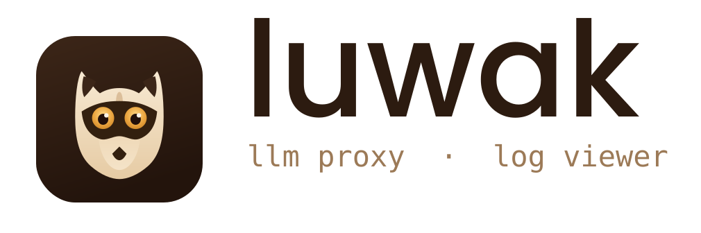
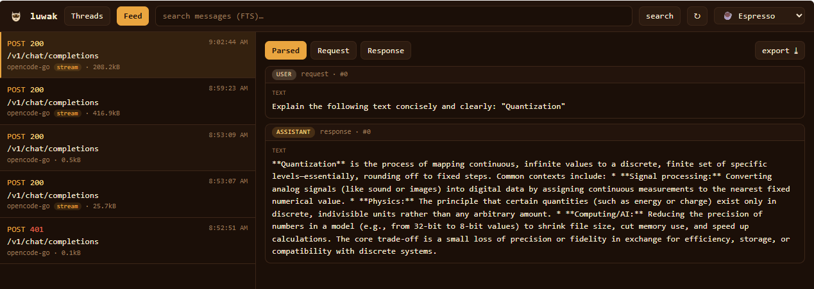
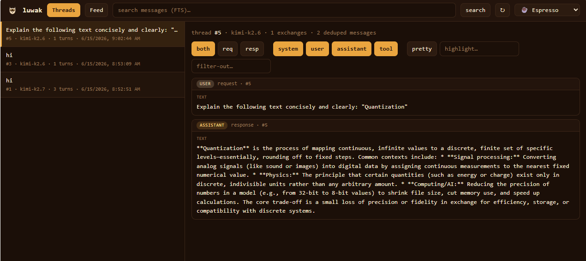
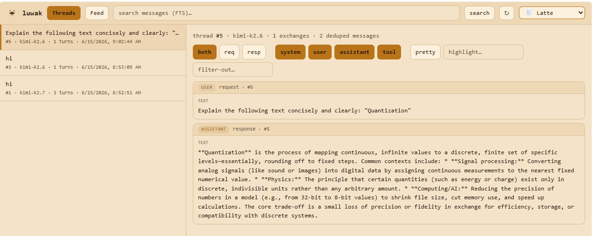
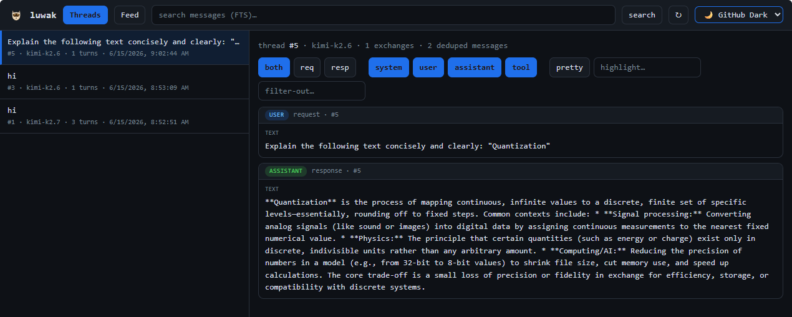
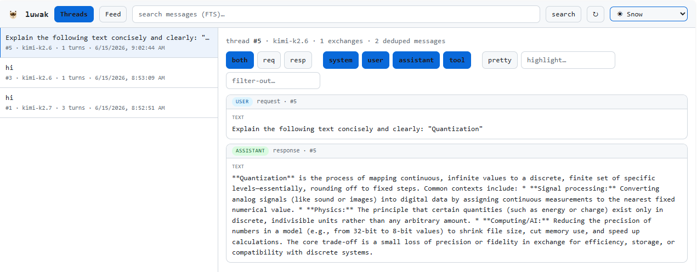

<p align="center">
  
</p>

<p align="center">
  A fast, light <b>LLM proxy</b> that captures raw request/response traffic from
  LLM clients (coding agents, chatbots), with a <b>viewer</b> for analyzing the
  captured conversations.
</p>

<p align="center">
  📖 <a href="./docs/GUIDE.md"><b>User guide</b></a> — start, configure, and
  analyze logs step by step. · 🏗 <a href="./DESIGN.md"><b>Architecture</b></a>
</p>

> **Status: M5 — MVP complete.** Anthropic + OpenAI adapters (OpenAI-compatible
> providers are config-only), reverse proxy + tee streaming + full raw capture
> (zstd) into SQLite, normalized canonical conversation model, FTS5 search,
> `reparse`, conversation threading with a deduped conversation view + composable
> lenses, **live token streaming** to the viewer, themeable UI, and **redacted
> export**.

---

## How it works

luwak sits between your LLM client and the real upstream API. Point the client's
base URL at luwak; it forwards every request to the upstream untouched (live
token streaming included) and captures the raw bytes on the way through. Nothing
about the client's behavior changes — you just get a complete, searchable record.

```
  client  ──►  luwak  ──►  upstream API
  (Claude Code,   │        (Anthropic, OpenAI,
   OpenAI SDK,    │         Groq, Ollama, …)
   …)             ▼
            raw capture → SQLite (zstd) → viewer
```

## Threads — the deduped conversation view

LLM APIs are stateless: every request resends the whole history. luwak chains
exchanges into a **thread** by matching each request's leading messages (hashed,
volatile ids stripped) against earlier requests: full prefix → `extend`, shared
head then divergence → `branch` (tagged `compaction/edit?`), no match → new
thread root. It then reconstructs the conversation by walking the chain and
emitting each message **only once**, so repeated history and echoed assistant
turns collapse into a single clean back-and-forth — system prompt once, each
user/assistant/tool turn once. The raw feed always remains ground truth.

**Composable lenses** stack on top of the conversation: scope (`both` / `req` /
`resp`), per-role toggles (`system` `user` `assistant` `tool`), `pretty` / `raw`
rendering, plus live `highlight…` and `filter-out…` text filters.

<p align="center">
  
</p>

API: `GET /api/threads` (summaries) · `GET /api/threads/:id` (deduped conversation + relations).

## Feed — raw exchange inspection

The Feed lists every individual HTTP exchange (method, status, provider, size,
streaming/partial tags, TTFB). Click one to inspect it across three tabs:
**Parsed** (canonical messages for that single exchange), **Request**, and
**Response** (raw headers + body with a `pretty`/`raw` toggle). Each exchange has
an **export ⤓** button that emits a redacted copy.

<p align="center">
  
</p>

The Feed is the **sacred layer** made visible: captured bodies are stored
verbatim and never altered, so it's the source of truth whenever a thread
reconstruction looks off.

## Normalization & search

Each captured exchange is parsed by a provider adapter into a canonical
content-parts model (`role` + ordered `text | tool_call | tool_result | image |
thinking` parts) and materialized into derived tables (`messages`, `parts`,
`messages_fts`) stamped with a `parser_version`. The proxy stays
provider-agnostic; normalization runs off an insert hook. Full-text **search**
(FTS5) runs over all normalized message text and returns ranked, highlighted
snippets labeled by role/source/exchange.

```sh
bun reparse        # rebuild the derived layer from sacred raw after a parser change
```

API: `GET /api/exchanges/:id/messages` (canonical model) · `GET /api/search?q=…` (FTS).

## Live tail & export

The proxy tees each streamed chunk to a viewer SSE channel (`GET /api/stream`),
so exchanges appear and stream **token-by-token** live — watch the agent think.
The tap is transport-level only; the proxy never interprets the bytes.

Captured data is stored verbatim; secrets are masked only at the **export
boundary** (built-in secret headers + key patterns, extendable via `redact:` in
config):

```sh
bun export > capture.jsonl        # redacted JSONL of every exchange
```

API: `GET /api/exchanges/:id/export` (redacted exchange) · `GET /api/stream` (live SSE).

## Themeable viewer

The viewer ships with several built-in themes, switchable live from the header —
warm `Espresso`/`Latte` coffee tones, a familiar `GitHub` light, and a clean
`Snow`.

<p align="center">
  
  
</p>
<p align="center">
  
  
</p>

## Run

```sh
bun run src/index.ts        # or: bun start
bun dev                     # watch mode
```

luwak reads `luwak.yaml` (override with `LUWAK_CONFIG=path`). By default it binds
`127.0.0.1:8080` and proxies Anthropic.

## Point a client at it

```sh
# Claude Code (and any Anthropic SDK client)
export ANTHROPIC_BASE_URL=http://localhost:8080/anthropic
# OpenAI SDK clients
export OPENAI_BASE_URL=http://localhost:8080/openai/v1
```

Traffic flows through luwak to the upstream, captured verbatim on the way.
OpenAI-compatible providers (groq, together, openrouter, ollama, …) just need a
config entry with `adapter: openai`.

## Inspect

Open the viewer at <http://localhost:8080/app>. Switch between **Threads**,
**Feed**, and **search** from the header, pick a theme, and click any exchange to
see its raw request/response, headers, timing (TTFB, chunk count), and a
pretty/raw toggle.

## Build a single binary

```sh
bun run build               # -> ./luwak (self-contained, viewer embedded)
```

## Notes

- The proxy forwards **live API keys** upstream — keep it bound to loopback.
- Captured bodies are stored verbatim, zstd-compressed (`exchanges_raw` is the
  sacred layer). Secrets are redacted only at the export boundary.
- Add an OpenAI-compatible provider (Groq, Together, OpenRouter, Ollama, …) by
  appending a config entry with `adapter: openai` — no code needed.

See the [user guide](./docs/GUIDE.md) for full configuration, the viewer's
analysis features (threads, lenses, search, live tail), and troubleshooting.
